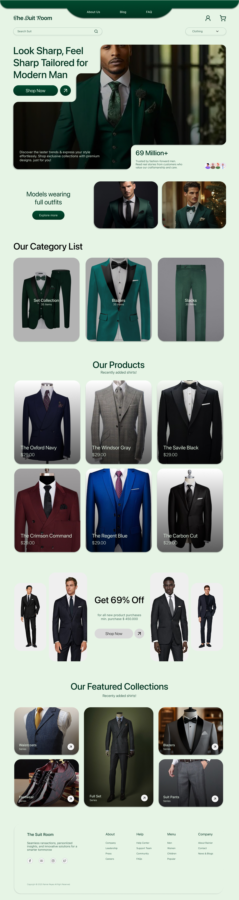
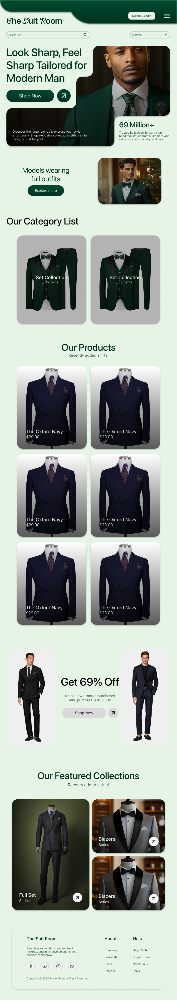
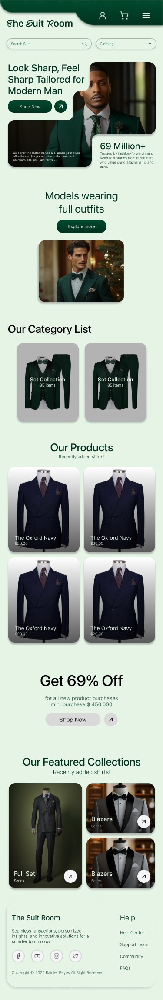
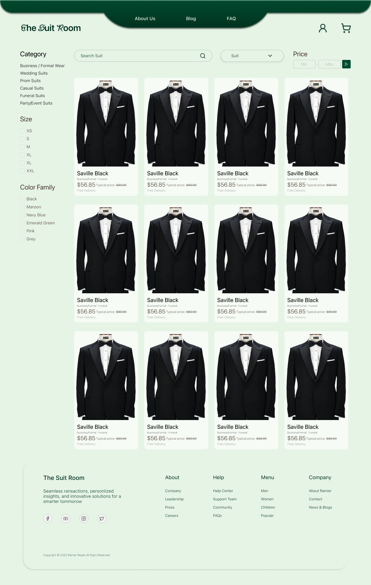
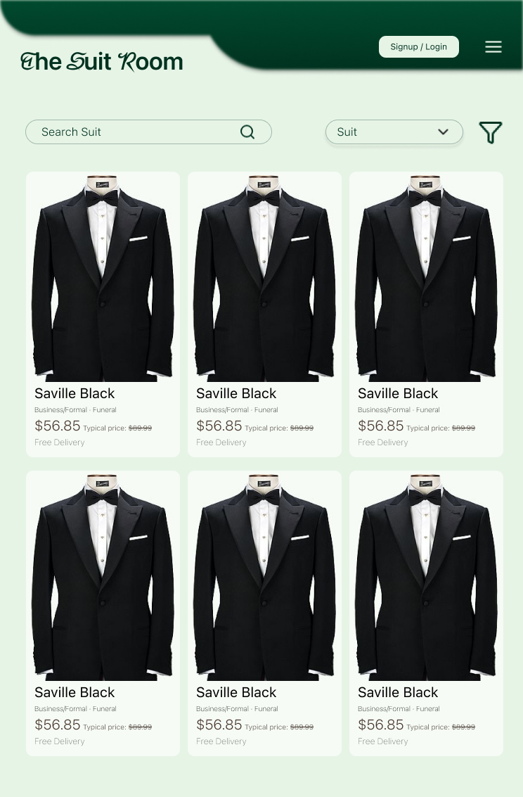
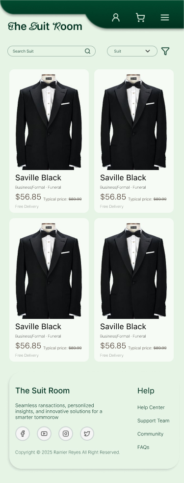
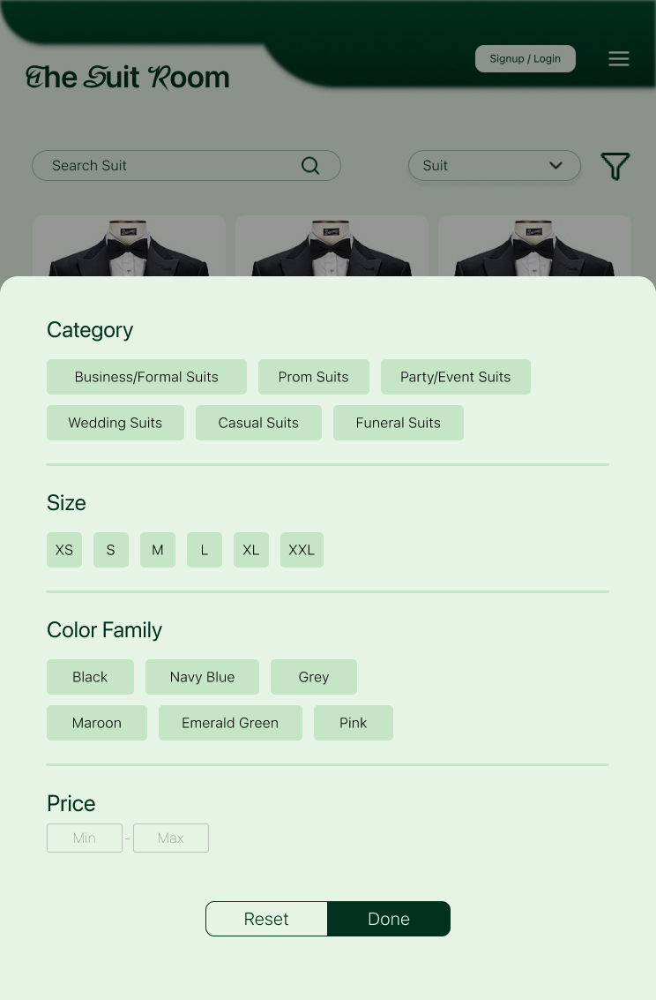
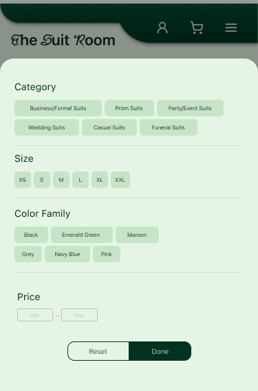

# Design Figma

<table>
  <tr>
    <td width="50%">
      
<strong>Desktop View</strong>

      
    </td>
    <td width="50%">
      
<strong>Tablet View</strong>

      
    </td>
  </tr>
   <tr>
    <td width="50%">
      
<strong>Mobile View</strong>

      
    </td>
  </tr>

  <tr>
    <td width="50%">
      
<strong>Desktop/Shop View</strong>

      
    </td>
    <td width="50%">
      
<strong>Tablet/Shop View</strong>

      
    </td>
  </tr>
   <tr>
    <td width="50%">
      
<strong>Mobile/Shop View</strong>

      
    </td>
  </tr>

  <tr>
    <td width="50%">
      
<strong>Tablet/Shop/filter View</strong>

      
    </td>
    <td width="50%">
      
<strong>Phone/Shop/filter View</strong>

      
    </td>
  </tr>
  
</table>
